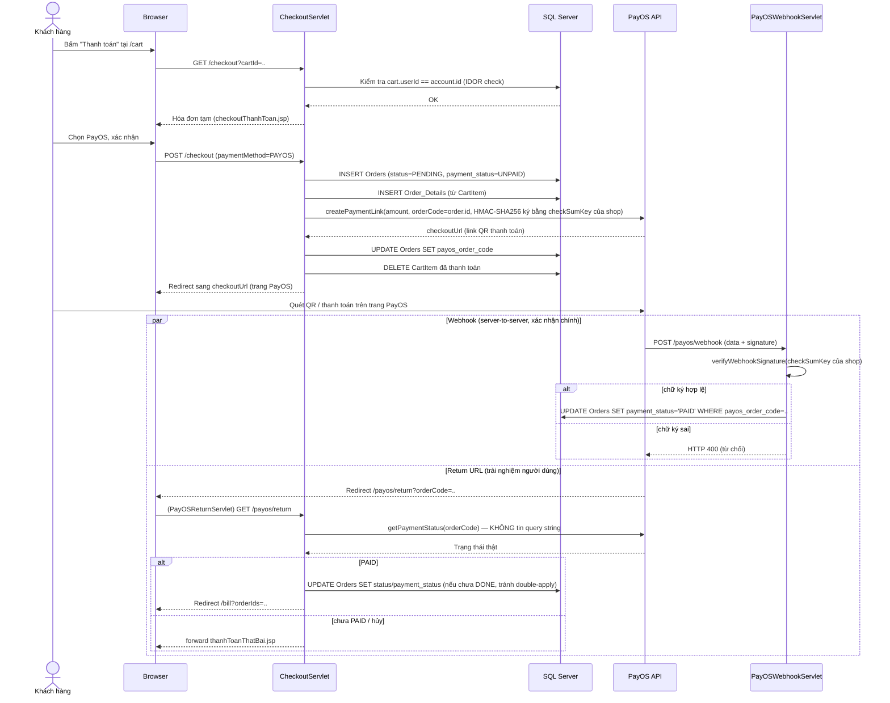
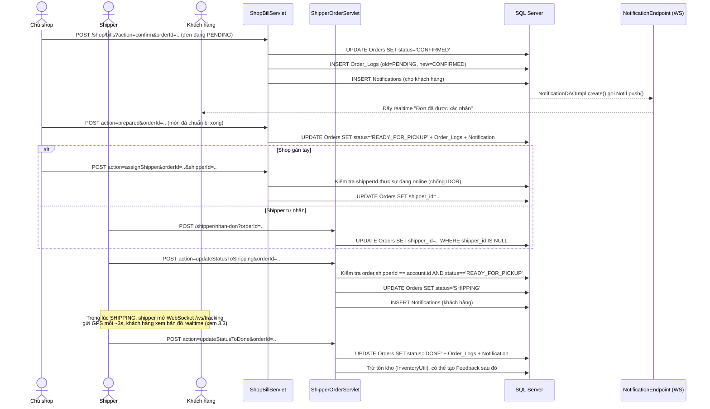
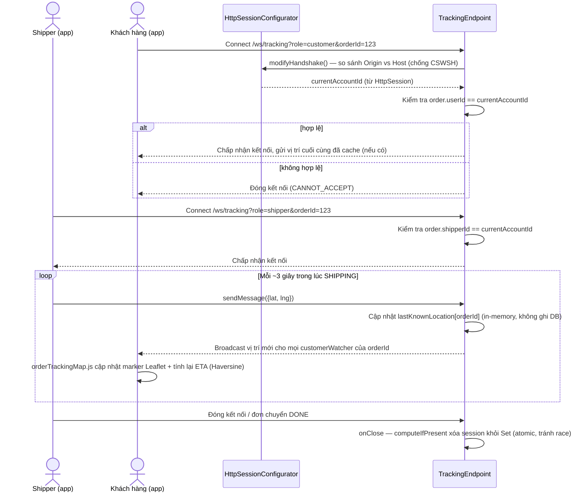
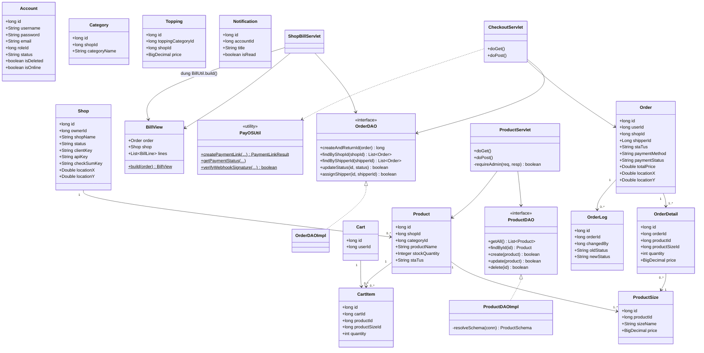
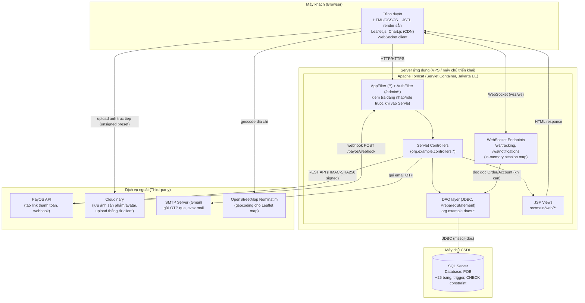

# TÀI LIỆU THIẾT KẾ HỆ THỐNG (ERD / Use Case / Sequence / Class / Deployment)

> Tài liệu này bổ sung phần **phân tích thiết kế** cho báo cáo đồ án tốt nghiệp — nội dung được
> soạn từ schema thật (`Database.md`) và code thật (servlet/DAO/model) đang chạy trong dự án,
> không phải thiết kế lý thuyết tách rời code. Tất cả diagram dùng cú pháp **Mermaid**, render
> trực tiếp trên GitHub/nhiều trình xem Markdown (kể cả không có mạng); có thể mở bằng
> [mermaid.live](https://mermaid.live) để export ảnh PNG/SVG dán vào file Word báo cáo.
>
> Đọc kèm [PROJECT_STRUCTURE.md](PROJECT_STRUCTURE.md) (bảng Endpoint→Servlet→DAO→JSP),
> [Database.md](Database.md) (DDL đầy đủ) và [CRUD_DA_LAM.md](CRUD_DA_LAM.md) (lịch sử code).

---

## 1. Sơ đồ thực thể quan hệ (ERD)

Phạm vi: các bảng nghiệp vụ chính (đã lược bớt vài bảng phụ ít quan hệ như `BannedWords`,
`Account_Appeals` để ERD không quá rối — 2 bảng đó chỉ có 1 FK đơn giản tới `Accounts`).

```mermaid
erDiagram
    ROLES ||--o{ ACCOUNTS : "phan quyen"
    ACCOUNTS ||--o| USER_PROFILES : "ho so (USER)"
    ACCOUNTS ||--o| SHIPPER_PROFILES : "ho so (SHIPPER)"
    ACCOUNTS ||--o{ USER_ADDRESSES : "dia chi giao hang"
    ACCOUNTS ||--o| SHOPS : "so huu (owner_id)"
    ACCOUNTS ||--o| CARTS : "gio hang"
    ACCOUNTS ||--o{ ORDERS : "dat don (user_id)"
    ACCOUNTS ||--o{ ORDERS : "giao don (shipper_id)"
    ACCOUNTS ||--o{ NOTIFICATIONS : "nhan thong bao"
    ACCOUNTS ||--o{ COMPLAINTS : "gui khieu nai"
    ACCOUNTS ||--o| SHIPPER_WALLETS : "vi tien (SHIPPER)"
    ACCOUNTS ||--o{ SHIPPER_WITHDRAWALS : "yeu cau rut tien"

    SHOPS ||--o{ CATEGORIES : "co loai san pham"
    SHOPS ||--o{ PRODUCTS : "co san pham"
    SHOPS ||--o{ TOPPING_CATEGORIES : "co loai topping"
    SHOPS ||--o{ TOPPINGS : "co topping"
    SHOPS ||--o{ ORDERS : "nhan don"
    SHOPS ||--o{ SHOP_SETTLEMENTS : "doi soat doanh thu"

    CATEGORIES ||--o{ PRODUCTS : "phan loai"
    CATEGORIES }o--o{ TOPPING_CATEGORIES : "TCPC: loai topping ap dung cho"

    PRODUCTS ||--o{ PRODUCT_SIZES : "co gia theo size"
    PRODUCTS ||--o{ PRODUCT_IMAGES : "co anh"
    PRODUCTS ||--o{ CART_ITEMS : "duoc them vao gio"
    PRODUCTS ||--o{ ORDER_DETAILS : "xuat hien trong don"

    TOPPING_CATEGORIES ||--o{ TOPPINGS : "gom nhom"

    CARTS ||--o{ CART_ITEMS : "chua"
    CART_ITEMS }o--|| PRODUCT_SIZES : "chon size"
    CART_ITEMS ||--o{ CART_ITEM_TOPPINGS : "chon topping"
    CART_ITEM_TOPPINGS }o--|| TOPPINGS : "topping nao"

    ORDERS ||--o{ ORDER_DETAILS : "gom cac dong"
    ORDERS ||--o{ ORDER_LOGS : "lich su trang thai"
    ORDERS ||--o{ COMPLAINTS : "bi khieu nai"
    ORDERS ||--o{ FEEDBACKS : "duoc danh gia"
    ORDER_DETAILS }o--|| PRODUCT_SIZES : "size da chon"
    ORDER_DETAILS ||--o{ ORDER_DETAIL_TOPPINGS : "topping da chon"
    ORDER_DETAIL_TOPPINGS }o--|| TOPPINGS : "topping nao"

    ACCOUNTS {
        bigint id PK
        varchar username UK
        varchar password "bcrypt hash"
        varchar email UK
        bigint role_id FK
        varchar status "ACTIVE/PENDING/BLOCKED"
        bit is_deleted
        bit is_online "chi dung cho SHIPPER"
    }
    SHOPS {
        bigint id PK
        bigint owner_id FK "UNIQUE - 1 account = 1 shop"
        varchar status "PENDING/ACTIVE/REJECTED/BLOCKED"
        varchar client_key "PayOS"
        varchar api_key "PayOS"
        varchar check_sum_key "PayOS"
        decimal locationX
        decimal locationY
    }
    PRODUCTS {
        bigint id PK
        bigint shop_id FK
        bigint category_id FK
        varchar status "ACTIVE/OUT_OF_STOCK/HIDDEN/PENDING_REVIEW"
        int stock_quantity
        bit is_deleted
    }
    PRODUCT_SIZES {
        bigint id PK
        bigint product_id FK
        decimal price "gia thuc te nam o day, khong o Products"
    }
    ORDERS {
        bigint id PK
        bigint user_id FK
        bigint shop_id FK
        bigint shipper_id FK "nullable, gan sau"
        varchar status "PENDING/CONFIRMED/READY_FOR_PICKUP/SHIPPING/DONE/CANCELLED"
        varchar payment_method "COD/BANK/PAYOS/MOMO"
        varchar payment_status "UNPAID/PENDING/PAID"
        varchar cancel_reason
        bigint payos_order_code
        decimal locationX
        decimal locationY
    }
    ORDER_LOGS {
        bigint id PK
        bigint order_id FK
        bigint changed_by FK
        varchar old_status
        varchar new_status
    }
    FEEDBACKS {
        bigint id PK
        bigint order_id FK
        varchar reviewer_type "USER/SHIPPER"
        varchar target_type "SHOP/SHIPPER"
        int rating "1..5"
        varchar status "VISIBLE/PENDING_REVIEW/REMOVED"
    }
    SHIPPER_WALLETS {
        bigint id PK
        bigint shipper_account_id FK UK
        decimal balance
    }
    SHIPPER_WITHDRAWALS {
        bigint id PK
        bigint shipper_account_id FK
        decimal amount
        varchar status "PENDING/APPROVED/REJECTED"
    }
    SHOP_SETTLEMENTS {
        bigint id PK
        bigint shop_id FK
        date period_start
        date period_end
        decimal net_payout
        varchar status "PENDING/PAID"
    }
    COMPLAINTS {
        bigint id PK
        bigint order_id FK
        bigint account_id FK
        varchar status "PENDING/PROCESSING/RESOLVED/REJECTED"
    }
```

**Ghi chú thiết kế đáng chú ý** (để trả lời khi hội đồng hỏi):
- `Products` **không có cột giá** — giá bán nằm hoàn toàn ở `Product_Sizes.price` vì 1 sản phẩm
  luôn bán theo nhiều size khác nhau; 1 sản phẩm phải có ≥ 1 size mới bán được.
- `ToppingCategories` liên kết N-N với `Categories` qua bảng trung gian
  `ToppingCategory_ProductCategories` (1 loại topping — vd "Trân châu" — có thể áp dụng cho nhiều
  loại sản phẩm — vd "Trà sữa" và "Cà phê" — cùng lúc; rỗng = áp dụng cho mọi loại).
- `is_deleted` (xóa mềm) chỉ có ở `Accounts/Shops/Categories/Products/ToppingCategories/Toppings`
  — **không có** ở `Orders` (lịch sử đơn hàng giữ vĩnh viễn, không xóa mềm).
- `Shipper_Wallets`/`Shipper_Withdrawals` được thêm sau qua `migration_shipper_withdrawals.sql`;
  đã xác nhận tồn tại trên DB thật và đã gộp vào `Database.md` (2026-07-23, xem mục 65 trong
  `CRUD_DA_LAM.md`). Lưu ý: hiện chưa có màn hình cho Shipper *tạo* yêu cầu rút tiền hay xem số dư
  ví — chỉ có Admin duyệt (`DuyetRutTienShipperServlet`) — luồng nghiệp vụ chưa khép kín đầu-cuối.

---

## 2. Sơ đồ Use Case theo vai trò (Role)

Hệ thống có 4 vai trò (`Roles.id`): `SUPER_ADMIN` (role_id=1), `ADMIN`/Shop Owner (role_id=2),
`USER`/Khách hàng (role_id=3), `SHIPPER` (role_id=4).

```mermaid
flowchart LR
    subgraph Actors[" "]
        User(("🧑 Khách hàng"))
        Shop(("🏪 Chủ shop"))
        Shipper(("🛵 Shipper"))
        Admin(("🛡️ Super Admin"))
    end

    subgraph UC_User["Use Case - Khách hàng"]
        u1([Đăng ký / Đăng nhập / OTP])
        u2([Quản lý địa chỉ giao hàng])
        u3([Duyệt sản phẩm theo shop])
        u4([Quản lý giỏ hàng])
        u5([Checkout - chọn COD/BANK/PayOS])
        u6([Theo dõi đơn hàng realtime])
        u7([Xem / in hóa đơn])
        u8([Đánh giá Shop / Shipper])
        u9([Gửi khiếu nại đơn hàng])
        u10([Nhận thông báo realtime])
    end

    subgraph UC_Shop["Use Case - Chủ shop"]
        s1([Đăng ký mở shop])
        s2([Quản lý sản phẩm / loại / topping])
        s3([Bán hàng tại quầy - POS])
        s4([Xác nhận đơn / gán shipper])
        s5([Xem dashboard doanh thu])
        s6([Xuất hóa đơn PDF / báo cáo Excel])
        s7([Cấu hình PayOS])
        s8([Khôi phục dữ liệu từ Thùng rác])
    end

    subgraph UC_Shipper["Use Case - Shipper"]
        p1([Đăng ký làm Shipper])
        p2([Bật/tắt trạng thái online])
        p3([Nhận đơn / được gán đơn])
        p4([Cập nhật SHIPPING → DONE])
        p5([Gửi vị trí GPS realtime])
        p6([Yêu cầu rút tiền ví])
        p7([Từ chối đơn / báo bom hàng])
    end

    subgraph UC_Admin["Use Case - Super Admin"]
        a1([Duyệt / từ chối Shop])
        a2([Duyệt / từ chối Shipper])
        a3([Quản lý tài khoản toàn hệ thống])
        a4([Kiểm duyệt sản phẩm / bình luận])
        a5([Xử lý khiếu nại])
        a6([Duyệt kháng nghị tài khoản bị khóa])
        a7([Đối soát doanh thu Shop])
        a8([Duyệt rút tiền Shipper])
        a9([Xem Dashboard / Báo cáo vận hành])
    end

    User --- u1 & u2 & u3 & u4 & u5 & u6 & u7 & u8 & u9 & u10
    Shop --- s1 & s2 & s3 & s4 & s5 & s6 & s7 & s8
    Shipper --- p1 & p2 & p3 & p4 & p5 & p6 & p7
    Admin --- a1 & a2 & a3 & a4 & a5 & a6 & a7 & a8 & a9
```



---

## 3. Sequence Diagram

### 3.1. Checkout → thanh toán PayOS → xác nhận qua Webhook

Endpoint liên quan: `/checkout` (`CheckoutServlet`), `/payos/webhook` (`PayOSWebhookServlet`),
`/payos/return` (`PayOSReturnServlet`).



### 3.2. Shop xác nhận đơn → gán Shipper → Shipper giao hàng

Endpoint liên quan: `/shop/bills` (`ShopBillServlet`), `/shipper/nhan-don`
(`ShipperAcceptOrderServlet`), `/shipper/donhang` (`ShipperOrderServlet`).



### 3.3. Theo dõi vị trí Shipper realtime (WebSocket)

Endpoint: `/ws/tracking` (`TrackingEndpoint`), dùng chung `HttpSessionConfigurator` để xác thực.



---

## 4. Class Diagram (rút gọn, các model cốt lõi)

Chỉ thể hiện field/method chính, bỏ getter/setter để dễ nhìn (Servlet gọi trực tiếp qua DAO,
không qua Service layer — đúng kiến trúc 3 lớp Servlet→DAO→Model của dự án).



---

## 5. Deployment Diagram



**Ghi chú triển khai**:
- Không dùng Spring/Spring Boot — chạy trực tiếp trên Tomcat qua `@WebServlet`/`@WebFilter`
  annotation, build bằng Maven (`pom.xml`).
- WebSocket (`TrackingEndpoint`, `NotificationEndpoint`) lưu trạng thái **in-memory** (`static
  Map` trong 1 JVM) — giới hạn đã biết: **không scale ngang được nhiều instance server** cùng lúc
  vì 2 kết nối tới 2 server khác nhau sẽ không thấy nhau. Phù hợp quy mô đồ án (1 instance).
- Ảnh (sản phẩm, avatar, CCCD shipper) không đi qua server — client upload thẳng lên Cloudinary,
  server chỉ lưu URL trả về.

---

## 6. Bổ sung: bảng ánh xạ Use Case → Endpoint (đối chiếu nhanh với code thật)

| Use Case | Vai trò | Endpoint | Servlet |
|---|---|---|---|
| Checkout, chọn thanh toán | User | `/checkout` | `CheckoutServlet` |
| Theo dõi đơn hàng realtime | User | `/ws/tracking` | `TrackingEndpoint` |
| Gửi khiếu nại | User | `/khieu-nai` | `ComplaintServlet` |
| Bán hàng tại quầy (POS) | Shop | `/shop/pos` | `ShopPosServlet` |
| Xác nhận đơn / gán shipper | Shop | `/shop/bills` | `ShopBillServlet` |
| Xem dashboard doanh thu | Shop | `/shop` | `ShopHomeServlet` |
| Nhận đơn | Shipper | `/shipper/nhan-don` | `ShipperAcceptOrderServlet` |
| Cập nhật SHIPPING/DONE | Shipper | `/shipper/donhang` | `ShipperOrderServlet` |
| Duyệt Shop | Super Admin | `/super-admin/shop-requests` | `SuperAdminShopRequestServlet` |
| Dashboard tổng quan | Super Admin | `/tong-quan` | `TongQuanServlet` |
| Báo cáo vận hành | Super Admin | `/admin/bao-cao-van-hanh` | `BaoCaoVanHanhServlet` |
| Đối soát doanh thu Shop | Super Admin | `/admin/doi-soat-doanh-thu-shop` | `DoiSoatDoanhThuShopServlet` |
| Duyệt rút tiền Shipper | Super Admin | `/admin/duyet-rut-tien-shipper` | `DuyetRutTienShipperServlet` |

Bảng đầy đủ (tất cả endpoint) xem [PROJECT_STRUCTURE.md](PROJECT_STRUCTURE.md) mục 3.
